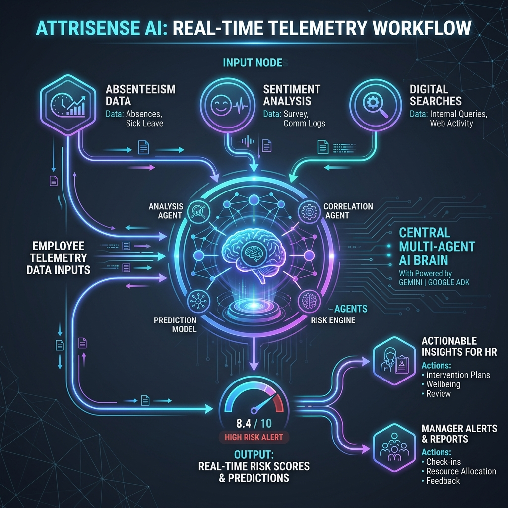
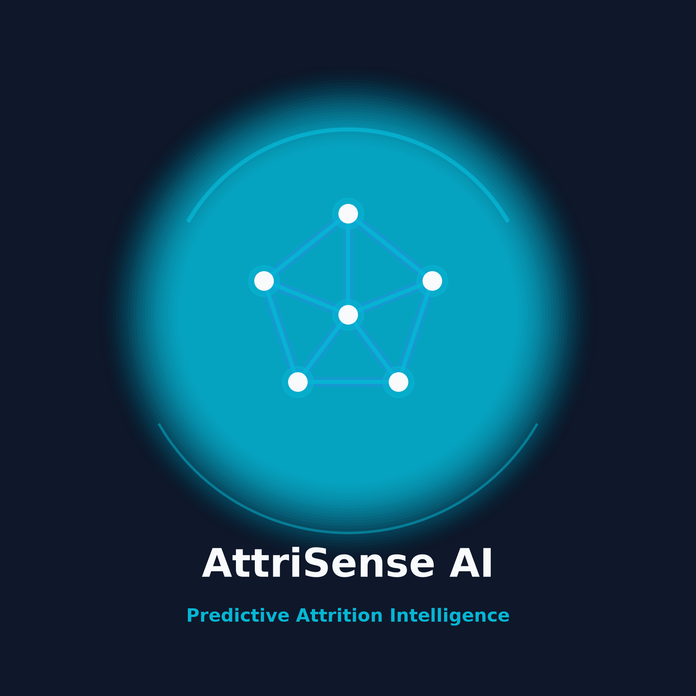

# AttriSense AI - Hackathon Submission Assets

Below are the generated submission assets to present AttriSense AI to the jury for the **LTTS Global Hackathon 2026**.

---

## 1. Submission Cover Banner
Use this high-impact banner as the header for your Devpost project profile, GitHub README, or presentation slide title.

---

## 2. Multi-Agent Workflow Diagram
Use this diagram in the project documentation or architecture slides to demonstrate the flow of telemetry signals through the Google ADK and Gemini 2.5 Flash orchestration brain to HR, Analyst, and Manager roles.

---

## 3. Official Platform Logo
The official logo for AttriSense AI. Fits perfectly as a profile picture, dashboard icon, or presentation header.

